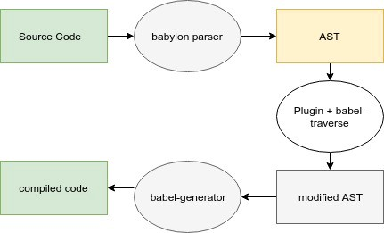

<span class="fl">F</span>eeling like this should have been something I'd write down 3 years ago, fine you asked for it.

<div class="sec-img">

<p class="caption">Source Code(babylon) > AST > Modified AST (plugin + babel-traverse)> Compiled Code(babel-generator)</p>
</div>
### Stage 1: Parsing
Babel takes the source code and convert it into AST(Abstract Syntax Tree) via Babel's [ babylon ](https://babeljs.io/docs/en/babylon.html) parser.

The AST should look like something below given the sample code: `(foo, bar) => foo + bar;`:
```json
// AST shortened for clarity
{
    "program": {
        "body": [
            {
                "type": "ExpressionStatement",
                "expression": {
                    "type": "ArrowFunctionExpression",
                    "params": [
                        {
                            "type": "Identifier",
                            "name": "foo"
                        },
                        {
                            "type": "Identifier",
                            "name": "bar"
                        }
                    ],
                    "body": {
                        "type": "BinaryExpression",
                        "left": {
                            "type": "Identifier",
                            "name": "foo"
                        },
                        "operator": "+",
                        "right": {
                            "type": "Identifier",
                            "name": "bar"
                        }
                    }
                }
            }
        ]
    }
}
```

### Stage 2: Transformation

This is where the magic occurs. In this stage, Babel takes the AST from the last step and manipulates it accordingly such that the resultant AST represents a browser suppported code. This stage is taken care by a Babel plugin/preset. Presets are just simply an array of plugins that make it easier to run a whole a set of transforms without specifying each one manually. You could use Babel’s plugin/preset or write your own plugin/preset for your own customised compilation. These plugins use babel-traverse to traverse through the AST and contains the code which defines how to modify/replace the original AST with the new AST.
The arrow function’s AST generated in the last step is manipulated to a new AST by traversing through the AST using babel-traverse and replacing the nodes of the AST (this replacement is done by the Babel plugin code).
This new AST represents browser supported code for arrow function:

```json
// AST shortened for clarity
{
    "program": {
        "type": "Program",
        "body": [
            {
                "type": "ExpressionStatement",
                "expression": {
                    "type": "Literal",
                    "value": "use strict"
                }
            },
            {
                "type": "ExpressionStatement",
                "expression": {
                    "type": "FunctionExpression",
                    "async": false,
                    "params": [
                        {
                            "type": "Identifier",
                            "name": "foo"
                        },
                        {
                            "type": "Identifier",
                            "name": "bar"
                        }
                    ],
                    "body": {
                        "type": "BlockStatement",
                        "body": [
                            {
                                "type": "ReturnStatement",
                                "argument": {
                                    "type": "BinaryExpression",
                                    "left": {
                                        "type": "Identifier",
                                        "name": "foo"
                                    },
                                    "operator": "+",
                                    "right": {
                                        "type": "Identifier",
                                        "name": "bar"
                                    }
                                }
                            }
                        ]
                    },
                    "parenthesizedExpression": true
                }
            }
        ]
    }
}
```
### State 3: Code Generation
Finally, Babel takes the new AST and change it to browser supported code via [babel-generator](https://babeljs.io/docs/en/babel-generator).
```javascript
"use strict";
(function (foo, bar) {
  return foo + bar;
});
```

*References*
```
https://medium.com/@makk.bit/babel-under-the-hood-63e3fb961243
```