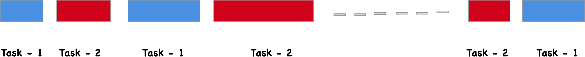
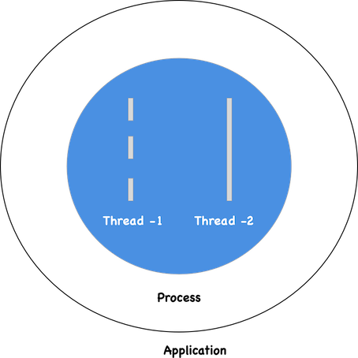
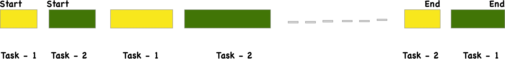
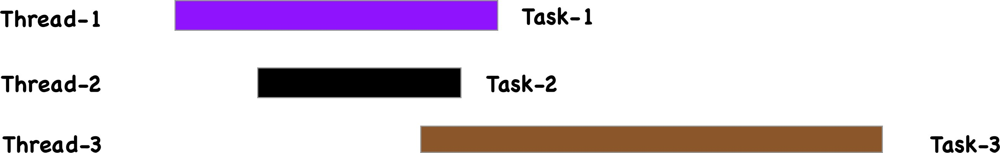

## Concurrency and Parallelism 并发和并行

### Concurrency 并发

<div class="message"> 一边吃火锅一边唱歌，吃一口火锅，唱一句歌。</div>

Concurrency， 一起，但不在同一时间段内，进行两个或者多个任务。In computer science world, concurrency 单核情况下，通过 [context switch](http://www.linfo.org/context_switch.html) 实现任务之间的跳转。多核情况下，concurrency 由 Parallelism 实现。

<div class="sec-img">
  
  <p class="caption">单核，执行通过 context switch 实现</p>
</div>

### Parallelism 并行

<div class="message">一边吃火锅一边唱歌，吃火锅的同时唱着歌。</div>

Parallelism， 一起，并在同一时间段内，进行两个或者多个任务。

<div class="sec-img">
  
  <p class="caption">一起，并在同一个时间内</p>
</div>

---
## Threads and Processes 线程和进程

### Threads 线程

<div class="message">多个手指，多个线程，手指在手上，手为进程</div>

Threads 在系统里面是可以被执行的最小单位，同时被包含在 processes 之中。

### Processes 进程

<div class="message">手接受任务，可以从单一手指开始工作，稍后在利用其他手指帮忙。</div>

计算机在跑的一次运行活动，一个程序可以有多个 processes. 通常来讲，process 开始的时候都只有一个主 threads，稍后执行程序的时候，可能会创造多个 threads。

<div class="sec-img">

  <p class="caption">Processes 和 Threads 的关系</p>
</div>

---

## Synchronous and Asynchronous 同步和异步

### Synchronous 同步

<div class="message">煮完咖啡，包三明治</div>
Sync 执行中，当有多个任务需要被执行的时候，按序进行。

### Asynchronous 异步
<div class="message">煮咖啡的时候，同时包三明治</div>
进行一个任务的时候，可以转换并且同时执行另一个任务。

---
## 同步异步在单核和多核之间的关系

### 同步单核

<div class="sec-img">

  <p class="caption">任务等待执行</p>
  </div>

### 同步多核
  <div class="sec-img">

  <p class="caption">任务在不同的线程等待在执行</p>
  </div>

### 异步单核

<div class="sec-img">

  <p class="caption">任务跳转执行，无需等待，但在同一时间内只能执行一个任务</p>
  </div>

### 异步多核
  <div class="sec-img">

  <p class="caption">一起，在同一个时间内，在多个线程分别执行</p>
  </div>

---
## 异步同步程序编制在并发和并行中的关系

* 异步编译可以实现并发

* 多核异步编译可以实现并行

---

## Javascript 异步原理

本地的 javascript 始终都是 single-threaded，只有在 runtime 的环境下才可以实现，并发，异步。
<div class="sec-img">
  
  <p class="caption">V8(Heap, Stack), Event Loop, Web API, CB Queue</p>
</div>
---

## References

```
* https://medium.com/swift-india/concurrency-parallelism-threads-processes-async-and-sync-related-39fd951bc61d
* https://softwareengineering.stackexchange.com/questions/190719/the-difference-between-concurrent-and-parallel-execution
* https://stackoverflow.com/questions/748175/asynchronous-vs-synchronous-execution-what-does-it-really-mean
* https://codewala.net/2015/07/29/concurrency-vs-multi-threading-vs-asynchronous-programming-explained/
* https://youtu.be/cN_DpYBzKso
* https://medium.com/flawless-app-stories/basics-of-parallel-programming-with-swift-93fee8425287
```