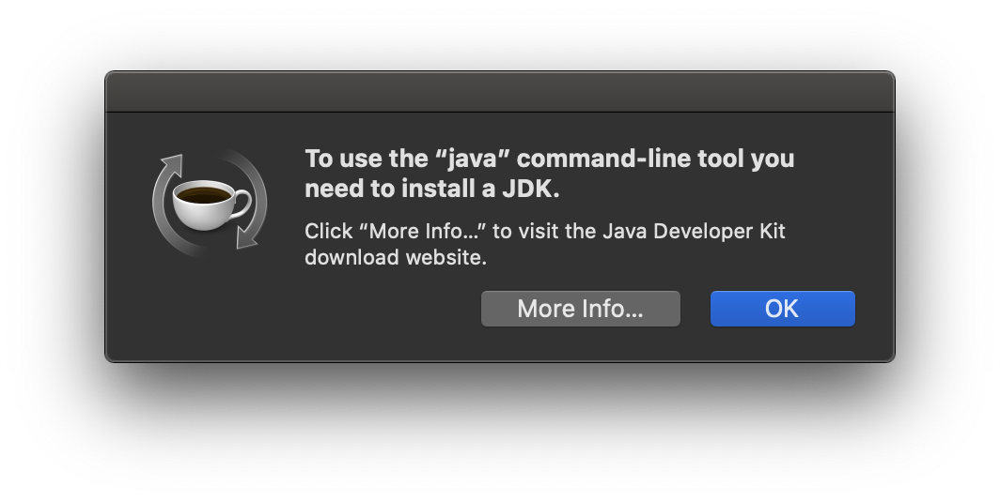
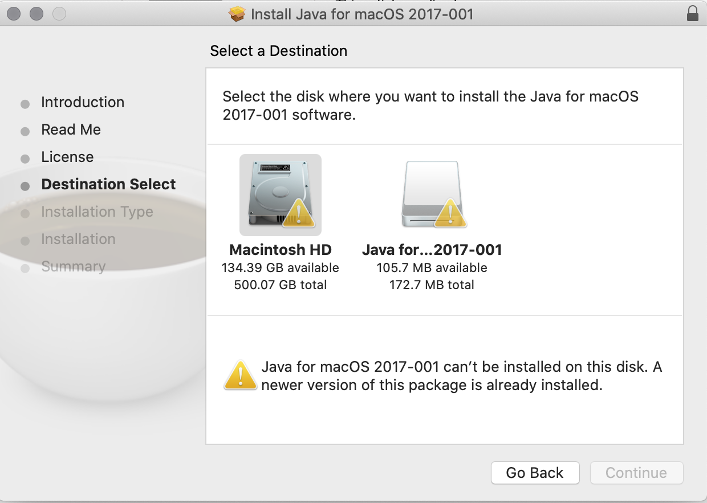

Man, I thought it was quite smooth, almost couldn't belive it, that I didn't run into any issues while upgrading macOS from Mojave to Catalina on my machine. Well, it did created some annoying files during the installation, but I sure can deal with it especially when I knew I could throw them to trash at almost no cost after a litte research.

The innerpeace of software doesn't settle long, the problem arises, the notorious Java Command-line Popup comes back again.

  
  
Here you go, one of the most notorious things knows on macOS

It is because some of the applications you are running depends on some denpendenices form a order version of Java. So, Apple has a offical fix for it at [ here ](https://support.apple.com/kb/dl1572?locale=en_US), it will install those certain dependenies for you to solve the problems. However, that only works if you aren't on Catalina.

  
  
On Catalina, you can't simple install the order version of Java

### References

* https://discussions.apple.com/thread/250853223
* https://www.harrisgeospatial.com/Support/Self-Help-Tools/Help-Articles/Help-Articles-Detail/ArtMID/10220/ArticleID/23780/Mac-OS-Catalina-1015-ENVIIDL-and-Legacy-Java-6-Dependencies
* https://discussions.apple.com/thread/250735756
* https://www.oracle.com/technetwork/java/javase/downloads/jdk13-downloads-5672538.html